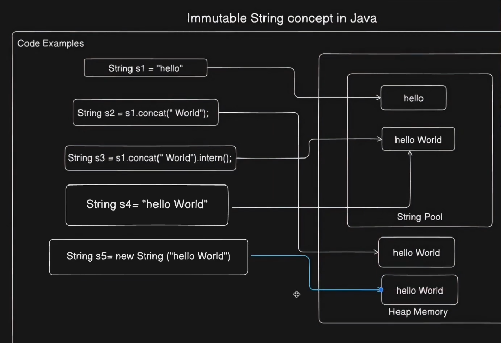

Questions:

1.What is the rule for naming a Java source file when it contains a public class? Can multiple classes exist in one file?
2.Can the main method be overloaded or overridden in Java? Explain why, which main method will be called in case of overriden
3.How are command-line arguments stored in main(String[] args)? Also, how can you read JVM arguments like -Denv=production?
4.Is Java pass-by-value or pass-by-reference? Explain behavior for primitives and objects.
5.Can a protected member be accessed outside its package? If yes, under what condition? explain default keyword
6.Explain key properties of the static keyword in Java, including static blocks, static methods, and static inner classes, can we make outer class static? how to crease object of inner static and non static class
7.Explain the use of final keyword with variables, methods, and classes. What is its behavior in final reference variable?
8.What is the purpose of the assert keyword in Java? How do you enable it at runtime? which exception will come if assertion fails
9.What is the use of the instanceof operator? What will be the result when a parent reference holds a child object?
10.What is the purpose of the transient keyword in Java? How does it affect serialization and deserialization?
11.What are Instance and local variables. Explain the differences between Stack Memory, Heap Memory, and String Constant Pool (SCP) in Java, explain when Stack Memory, Heap Memory, and String Constant Pool gets cleaned 
12.Strings immutable or mutable? Explain how memory is allocated for string literals, new String(), and string concatenation(The + operator and .concat())  String s1 = new String("abhi"), will "abhi" created in heap and SCP both? and where s1 present?
13.Explain how bitwise operators (&, |, ^) work in Java with examples.
14.Explain the default methods in interfaces
15.checked vs unchecked exceptions, correct order of catch block
16.how to create an immutable class
17.what is a record in Java 17 along with its advantages.

1.**File name questions:**

    🔴 In Java, you can only have one public class per source file, and the name of the source file must match the name of the public class. However, you can have
    multiple non-public classes in a single file.

    🔴 It is mandatory to make the public class name and file name the same in Java because the Java compiler uses the file name 
    to determine the name of the public class defined in the file.

2.**Main Method questions:**

    🔴 we can overload main but can't override because it's static (Static method becomes class property)

    🔴 If you don't call the overloaded main methods explicitly, only the standard main(String[] args) will execute, because that's the entry point for the JVM.

    🔴 If we pass program argument as "hello world" 123 then args[0] = "hello world" and args[1] = "123".

3.**-Denv=production passed in VM argument then String env = System.getProperty("env"); or in Spring @Value("${env}")private String env;**

4.**For primitive it's pass by value and non-primitive it's pass by reference**

5.**Protected keyword variable Access in a subclass (even outside the package) is allowed, default only in same package**

6.**Static Keyword questions:**

    🔴 static block will always execute when class object created

    🔴 We can't make main class static, only inner class can be static

    🔴 Can't override static method, can't extend static inner class

    🔴 create object of inner static class(Abhinav) and inner non static class SOumya as:
            Abhinav abhinavObj= new StaticExample.Abhinav();
            Soumya soumyaObj = new StaticExample().new Soumya();
    🔴 Access non static variable from static method:
        class Example {
            int instanceVariable = 10; // Non-static variable
        
            static void staticMethod() {
                Example obj = new Example(); // Create an instance
                System.out.println("Instance Variable: " + obj.instanceVariable);
            }
        }

7.**Final Keyword questions:**

    🔴 With variable:
       1️ A final variable can be assigned only once. Once assigned, its value cannot be changed.
            final String s="Abhinav";
            s="setu"; // Compilation error (cannot reassign)️

       2️ Final Reference Variable can refrered to one object only:
            final StringBuilder sb = new StringBuilder("Hello");
            sb.append(" World");  // Allowed (modifying the object)
            sb = new StringBuilder("New"); // Compilation error (cannot reassign)️

    🔴 A final method cannot be overridden by subclasses.

    🔴 A final class cannot be extended (no subclass can be created).

8.**Assert keyword:**

    🔴 Used for debugging purpose, in vm argument pass -ea:com.myapp (in com.myapp package assert will be enabled)

    🔴 int x = -1;
       assert x > 0 : "x must be positive!"; //Exception in thread "main" java.lang.AssertionError: x must be positive!

9.**instanceOf keyword:**

    🔴 to check whether object is instance of Class or not

    🔴 Parent obj = new Child();
        System.out.println(obj instanceof Parent); // true
        System.out.println(obj instanceof Child);  // true

10.**Transient keyword:**

    🔴 When an object is serialized, all its fields (including private ones) are by default included in the serialized output. 
       However, some fields might contain sensitive information (e.g., passwords) or data that is irrelevant for serialization (e.g., cached values or database connections). Marking these fields as transient ensures that they are not saved and do not become part of the serialized object.

    🔴  User user = new User("john_doe", "secure123");
        // Serialize object 
        ObjectOutputStream oos = new ObjectOutputStream(new FileOutputStream("user.txt")); //user.txt is a file that stores the serialized object in binary format.
        oos.writeObject(user);
        oos.close();
        
        // Deserialize object
        ObjectInputStream ois = new ObjectInputStream(new FileInputStream("user.txt"));
        User deserializedUser = (User) ois.readObject();
        ois.close();
        
        // Output
        System.out.println("Deserialized User: " + deserializedUser.password); // password null

11.**Memory allocation:**

    🔴 Variables in Java
    Local Variables
    → Declared inside methods, constructors, or blocks
    → Stored in Stack memory
    → Created when method starts, destroyed when method ends
    Instance Variables
    → Declared inside class, outside methods
    → Stored in Heap (inside object)
    → Exist as long as the object exists

    🔴 Memory Areas in Java
    1. Stack Memory Stores:
        Local variables
        Method calls (stack frames)
        Every method call creates a new stack frame
        Automatically cleaned when method finishes

    2. Heap Memory Stores:
        Objects
        Instance variables (inside objects)
        Shared across all threads
        Cleaned by Garbage Collector

    3. String Constant Pool (SCP)
        Special area inside Heap
        Stores string literals only
        Example: "Java", "Alice"
        Also cleaned by Garbage Collector

    🔴 Important Rules (Very Important for Interviews)
          new keyword → Object goes to Heap
          String literal → Stored in SCP
          Local variables → Stored in Stack
          Object fields → Stored inside Heap object
    🔴 Example Explained

          class Person {
          String name; // stored inside heap object}
        public class HeapExample {
        public static void main(String[] args) {
        String s = "Java";
        Person p1 = new Person();
        p1.name = "Alice";
         }
        }
    🔴 Memory Visualization
    Stack:
    | main() Frame   |
    | s              |
    | p1 (reference) |

    Heap:
    | Person Object  |
    | name → "Alice" |

    SCP:
    | "Java"  |
    | "Alice" |

    🔴 Final One-Line Summary (Best for Revision)
    👉 Stack = method execution + local variables
    👉 Heap = objects + instance variables
    👉 SCP = string literals (inside heap)

12.**String questions:**

    🔴  String (Immutable)
            A String in Java is immutable, meaning once it is created, it cannot be changed.
            Every modification creates a new object in memory.
            Stored in the String Constant Pool (SCP) for optimization.
        Code:
            String s1 = "Hello";           // Stored in SCP
            s1.concat(" World"); // does NOT change original string, s1 is still "Hello", but it will change in Buffer/Builder
            String s2 = s1 + "World";     // New object created in heap, The + operator triggers StringBuilder concatenation at runtime, that's why heap came in picture
            String s3 = (s1 + "Abhi").intern();

            SCP (Part of Heap):
            | "Hello"        |
            | " World"       |
            | " Hello Abhi" |
            
            Heap:
            | "Hello World" (created at runtime) |
    
            Stack:
            | s1 ->Pointing to SCP |
            | s2 ->Pointing to Heap|
            | s3 ->Pointing to SCP |

    🔴  StringBuffer (Mutable & Thread-Safe)

    🔴  StringBuilder (Mutable & Faster beacause it's not tread safe i.e. it does not have synchronization overhead.)

    🔴  String s1 = new String("abhi"); //Below things will happen
            SCP:
            | "abhi" |  <-- Created if not already present
            
            Heap:
            | "abhi" (New object from `new String()`) |

            Stack:
            | s1 ->Pointing to Heap |

    🔴  String s0 = new String("abhi");  // Heap object
        String s1 = new String("abhi");  // Heap object
        String s2 = "abhi";              // SCP object
        String s3 = "abhi";             // SCP object
        String s4 = new String("abhi").intern();         // s4 points to SCP object

        System.out.println(s0 == s1); // true (heap vs heap)
        System.out.println(s1 == s2); // false (heap vs SCP)
        System.out.println(s2 == s3); // true (both in SCP)
        System.out.println(s2 == s4); // true (both in SCP)
        System.out.println(s1 == s4); // false (heap vs SCP)

13.**Bitwise operator**

    🔴  Divide the number by 2 and write down the quotient and remainder.
        Divide the quotient by 2 and write down the quotient and remainder.
        Repeat the process until the quotient becomes 0.
        Read the remainders from bottom to top to get the binary representation
    🔴  AND operator: "&" returns a value with 1s only where both operands have 1s,and 0s elsewhere.
        OR operator: "|" returns a value with 1s where either or both operands have 1s, and 0s elsewhere.
        XOR operator: "^" returns a value with 1s only where the operands have different values, and 0s if same.
        3 | 5 will return 7, we need to convert 3 and 5 to binary
        3^3 will return 0, beacuse all binary will be same for both numbers
        3^0 will return 3, think 
        3^7 will return 4, we need to convert 3 and 4 to binary

14.**Interface**

    🔴 Default methods strike a balance between interface flexibility and backward compatibility

15.**Exception Handeling**

    🔴  Checked Exceptions
        These are exceptions that are checked at compile-time.
        The compiler mandates handling them using try-catch or declaring them with throws.
        Typically used for recoverable situations (e.g., file not found, network issues).
        Examples:
        
        IOException
        SQLException
        FileNotFoundException
        ClassNotFoundException

    🔴  UnChecked Exceptions
        These are exceptions that occur at runtime and are not checked at compile-time.
        They usually result from programming errors like null pointer access, array index out of bounds, etc.
        Extends RuntimeException.
        Examples:
        
        NullPointerException
        ArrayIndexOutOfBoundsException
        ArithmeticException
        NumberFormatException

    🔴 Correct order of catch: (Most Specific First i.e. downwards first)

        Throwable
        ├── Error
        │   ├── OutOfMemoryError
        │   ├── StackOverflowError
        │   ├── VirtualMachineError
        │
        └── Exception
        ├── IOException (Checked)
        │   ├── FileNotFoundException
        │   └── EOFException
        │
        ├── SQLException (Checked)
        │
        ├── RuntimeException (Unchecked)
        ├── NullPointerException
        ├── ArithmeticException
        ├── ArrayIndexOutOfBoundsException
        └── IllegalArgumentException

16.**Immutable class is a class whose objects cannot be modified after they are created. Once you initialize the object, its state stays constant for its entire lifetime.**

    Should be final
    fields private and final
    initialize fields by constructor
    no setter
    
    final class Student {
    private final int id;
    private final String name;

    // Constructor
    public Student(int id, String name) {
        this.id = id;
        this.name = name;
    }

    // Getter methods only
    public int getId() {
        return id;
    }

    public String getName() {
        return name;
     }
    }

17.**Record Class in java 17**

    In Java, when you define a record, the compiler automatically provides implementations for the equals(),hashCode(), and toString() methods based on all the fields (components) of the record. see record Emplyee